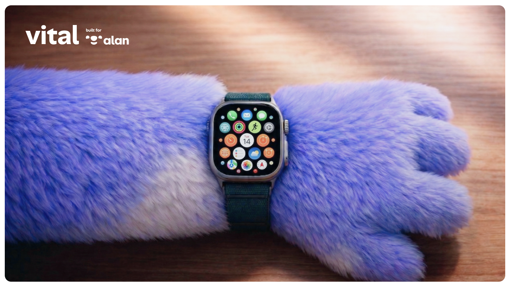

<h1 align="center">Vital</h1>

  <strong>Voice-Integrated Tracker & Adaptive Listener</strong> 
  <em>The first proactive health coach that actually remembers you.</em>

  
  

  
  
  
  
  &nbsp;&nbsp;
  

---

> Built for the [**Alan × Mistral AI Health Hack**](https://luma.com/t7rspaka) — April 11, 2026, Paris.

<table border="0" cellspacing="0" cellpadding="0"><tr>
  <td></td>
  <td></td>
</tr></table>

## Status

Active post-hackathon refactor.  

Cleaning up the codebase, opening contributions, and building the team to take Vital further !

## License

MIT

---
